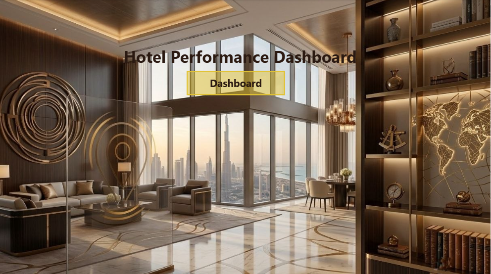
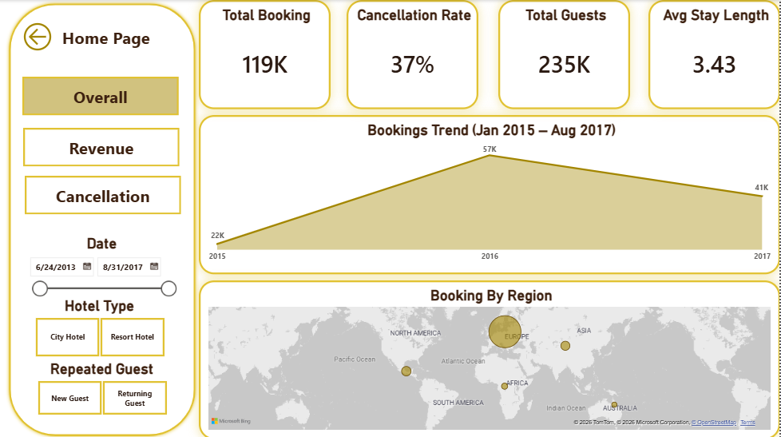
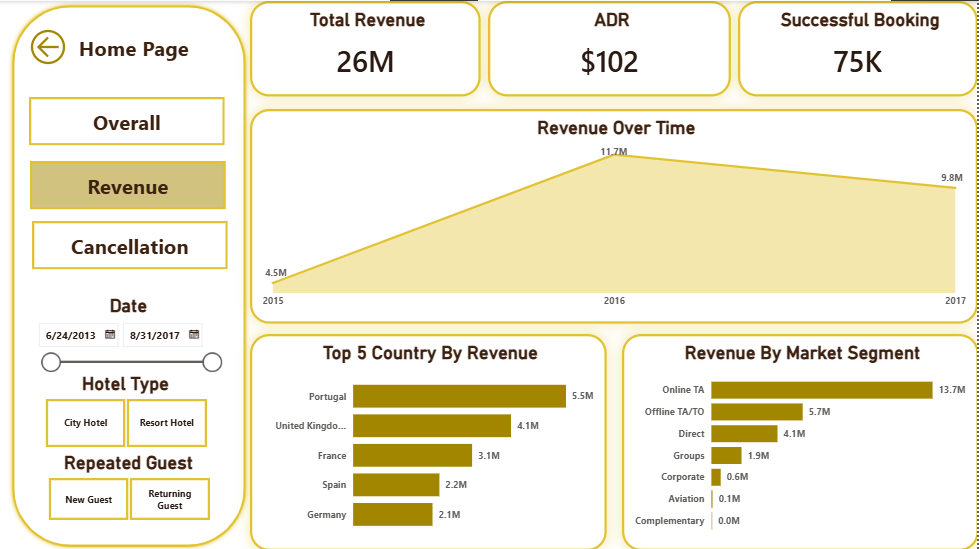
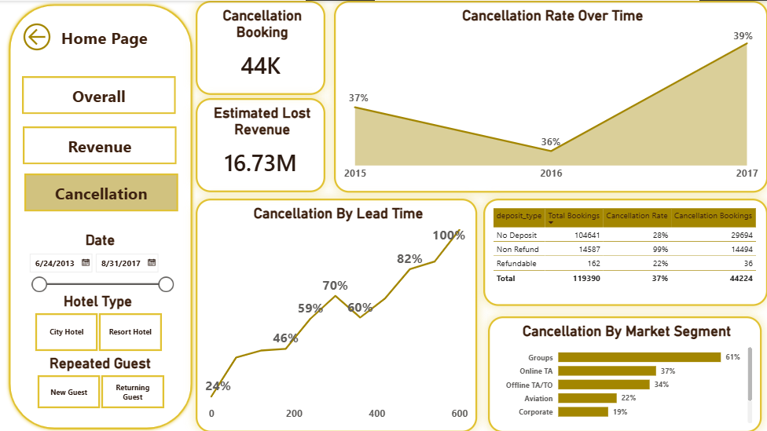
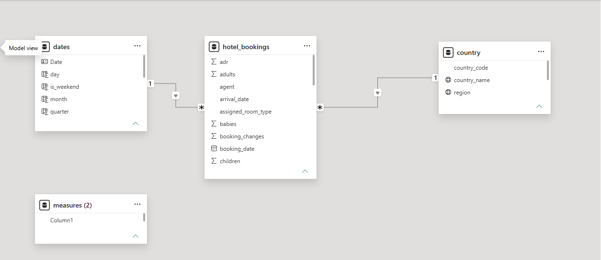

# Hotel Booking Analysis Dashboard

## Project Overview

This project analyzes hotel booking data to understand booking behavior, revenue performance, cancellation patterns, and customer segments.

The project was developed using Power BI and covers the complete analytics workflow, including data cleaning, data modeling, KPI development, dashboard design, and business insight generation.

---

## Tools & Technologies

- Power BI
- Power Query
- DAX
- Data Modeling
- Star Schema
- Data Visualization

---

## Dashboard Preview

### Home Page



### Overall Dashboard



### Revenue Dashboard



### Cancellation Dashboard



---

## Data Model



---

## Dashboard Pages

### Overall Performance Dashboard

This page provides a high-level overview of business performance and booking activity.

KPIs:
- Total Bookings
- Total Guests
- Cancellation Rate
- Average Stay Length

Visuals:
- Booking Trend
- Geographic Distribution of Bookings

---

### Revenue Analysis Dashboard

This page focuses on revenue performance and revenue drivers.

KPIs:
- Total Revenue
- ADR (Average Daily Rate)
- Successful Bookings

Visuals:
- Revenue Trend
- Revenue by Market Segment
- Top Revenue Generating Countries
- Revenue by Meal Type

---

### Cancellation Analysis Dashboard

This page focuses on cancellation behavior and cancellation-related revenue loss.

KPIs:
- Cancellation Bookings
- Estimated Lost Revenue

Visuals:
- Cancellation Trend
- Cancellation Rate by Lead Time
- Cancellation by Deposit Type
- Cancellation by Market Segment

---

## Key Business Insights

### Demand & Customer Behavior

- City Hotels generated significantly more bookings than Resort Hotels.
- Resort Hotel guests stayed longer on average.
- The business relies heavily on acquiring new guests.
- Returning guests demonstrated much lower cancellation rates.
- Returning Resort Hotel guests represented the most reliable customer segment.

### Revenue Insights

- Total realized revenue exceeded $26M.
- Revenue peaked during 2016.
- Online Travel Agencies generated the largest share of revenue.
- Portugal was the highest revenue-generating country.

### Cancellation Insights

- Overall cancellation rate reached 37%.
- Estimated lost revenue exceeded $16M.
- Group bookings recorded the highest cancellation rate.
- Cancellation rates increased significantly as Lead Time increased.
- Long-term bookings represented the highest cancellation risk.

---

## Project Structure

```text
Hotel_Booking/
│
├── Hotel Booking Analysis.pbix
├── Documentation.pdf
├── README.md
│
└── Images1
    ├── Home_page.png
    ├── overall.png
    ├── revenue.png
    ├── cancellation.png
    └── ERD1.png
```

---

## Files Included

- Power BI Dashboard (.pbix)
- Project Documentation (.pdf)
- Dashboard Screenshots
- Data Model Image

---

## Conclusion

The analysis revealed that City Hotels drive the majority of demand while Resort Hotels provide more stable bookings and longer stays. Revenue is highly concentrated in online booking channels and European markets, while cancellations remain a major source of lost revenue. Customer retention appears to be a key factor in improving booking stability and overall business performance.
